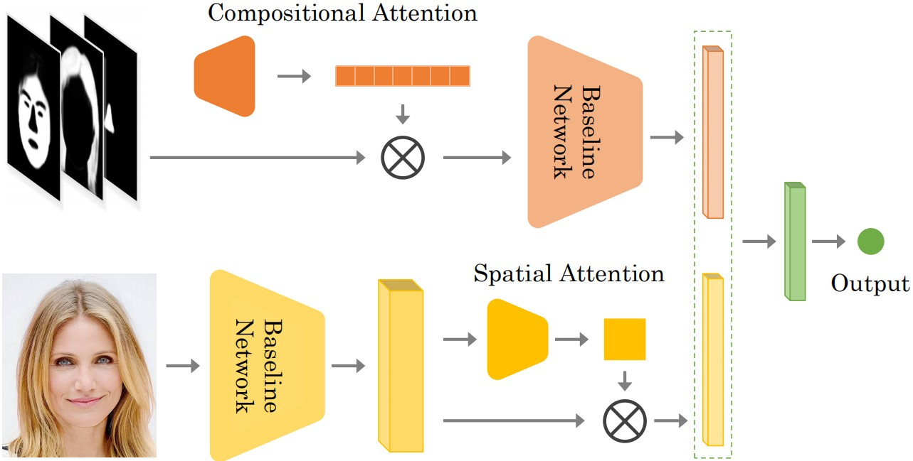
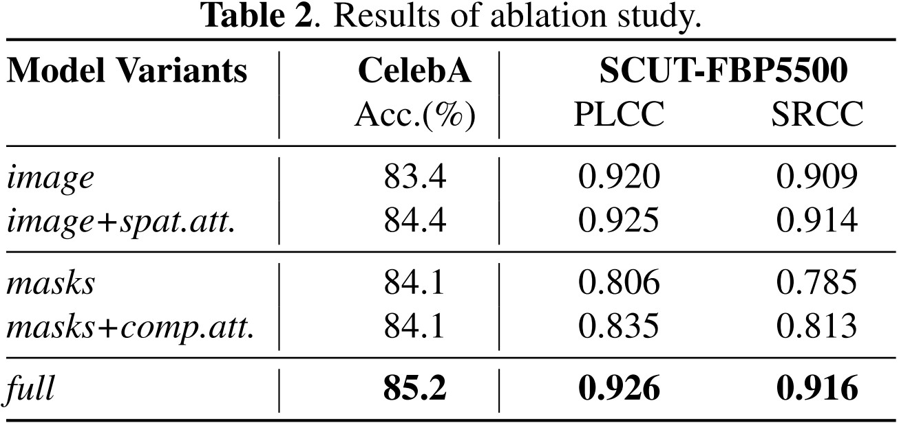
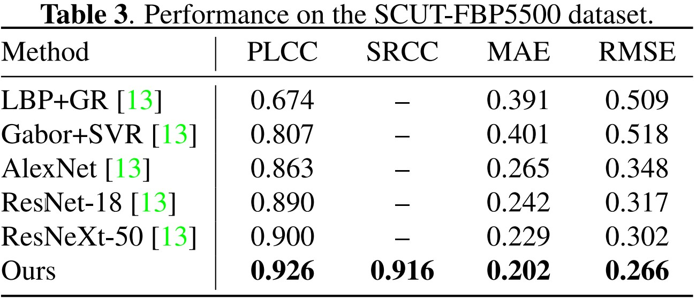

# Facial Attractiveness Prediction 
> Pytorch code for our paper: Improving facial attractiveness prediction via co-attention learning.

## Citation

```
@inproceedings{shi2019improving,
  title={Improving facial attractiveness prediction via co-attention learning},
  author={Shi, Shengjie and Gao, Fei and Meng, Xuantong and Xu, Xingxin and Zhu, Jingjie},
  booktitle={2019 IEEE International Conference on Acoustics, Speech and Signal Processing (ICASSP'19)},
  pages={4045--4049},
  year={2019},
  organization={IEEE}
}
```

## Framework



## Code

- pretrain models are released in `pretrain_model`. `net_cross_1` denotes `cross_validation_1`,`net_cross_2` denotes `cross_validation_2`, etc.
- change the `infofile` and `pretrain` in `option.py` and run `test.py` to check the pretrained model.
- change the `infofile` and run `main.py` to train your own models.
- Face parsing
  - here we use [Face Labling](https://github.com/Liusifei/Face_Parsing_2016) to get face parsing;
  - An aternative choice: [BiSeNet](https://github.com/zllrunning/face-parsing.PyTorch).

## Data

- We use SCUT-FBP5500-Dataset. There are five folders named data1,data2,...,data5 corresponding to 5-folds cross validation. 
- For each validation, 80% samples (4400 images) are used for training and the rest (1100 images) are used for testing.
- The results folder contains our results(srcc and plcc ) of different dataset splitions.
- We align the images with 5 points first and then use Face Labling to get face parsing


## Results






> You can also download the same files from [Google Drive](https://drive.google.com/file/d/1t8zHqp1Z42ZPIavdYVA4Kkf-awWgZblE/view?usp=sharing).